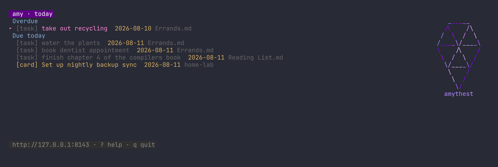
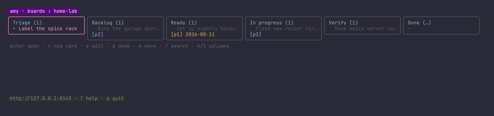

# Amythest 🔮

A fast, single-binary publishing server for Obsidian-style vaults, written in
Go. Amythest gives you the [Quartz](https://github.com/jackyzha0/quartz)
experience — wikilinks, backlinks, an interactive spring graph, ⌘K full-text
search, a polished reading UI — plus the things a static site generator can't
do, at a fraction of the memory.

Born as a replacement for a Node/Quartz setup that peaked at **1.24 GiB RSS**
on a Raspberry Pi. Amythest serves the same 1,700-note vault in **~50 MB**,
cold-indexes it in about a second, and never serves a stale build because
there is no build.


*Same vault, same Raspberry Pi, same day: Quartz (teal) vs Amythest
(green) resident memory across the cutover.*


*Notes: explorer + section nav, rendered note, spring graph, table of
contents, and backlinks.*


*Kanban: markdown-backed boards with metadata, P0-P3 priority, one explicit focus card per board,
card search, labels, comments, due dates, blocked flags, and safe cross-board moves.*

## What's inside

- **Live server, not a build step.** Pages render from an mmap'd SQLite
  index (FTS5) that reconciles with the vault on a fixed interval — the
  rescan *is* the freshness guarantee, so there is no file watcher to die.
  Full reconcile of ~1,700 notes: ~1.4 s cold, no-op when nothing changed.
- **Obsidian-flavored markdown**, AST-based (goldmark): `[[wikilinks]]` with
  `#heading` and `|alias`, transclusions with cycle guards, callouts
  (including unknown types), `==highlights==`, `#tags`, `[Key:: value]`
  inline fields, checkboxes, chroma-highlighted code, lazy-loaded mermaid.
  Frontmatter parsing **never fails the page** — malformed legacy YAML is
  preserved raw instead of crashing the renderer.
- **Graph view**: d3-force on canvas. Local BFS neighbourhood on every page,
  global graph in a modal, drag/zoom/pan, visited-node tinting.
- **Search**: server-side SQLite FTS5 with snippet highlighting behind a
  ⌘K modal — the full corpus never ships to the browser. Archived notes
  (frontmatter `archived: true`/`status: archived`, or an `archive`/`archived`
  tag — which covers kanban `done.md` boards) are excluded by default; the
  modal's "Include archived" checkbox or `GET /api/search?include_archived=1`
  brings them back, each result flagged with its archived provenance.
- **Kanban built in.** Boards are markdown files inside the vault — human
  readable in Obsidian, canonical on disk — managed by a locked, journaled,
  crash-safe store with a stable JSON API and an embedded React board UI at
  `/kanban`. Create and organize boards in the UI, pin them in a chosen order,
  archive dormant boards without deleting their history, delete only boards with
  no active or archived cards, and use the cross-board Focus view at
  `/kanban/focus` to see the most important active work together.
- **Tasks**: Obsidian Tasks emoji syntax (📅 ⏳ 🔁 ⏫ ✅) indexed vault-wide;
  ```` ```tasks ```` blocks in notes render live results (filters, relative
  dates, sort/group/limit); `/tasks` dashboard; file-first `/tasks/triage`
  workflow for undated work (intentional `#backlog`, real due date, reference
  bullet, or cancellation); `/api/tasks`.
- **Bases**: `.base` YAML views over your frontmatter with the Obsidian
  Bases expression language (`note.*`, `file.*`, `formula.*`, `if()`,
  string/number/date/list methods, `file.hasTag()` …) rendered as
  table / list / cards / board views at `/bases/{name}` and inline via
  ```` ```base ```` blocks. Unsupported expressions degrade to per-cell
  errors, never broken pages.
- **Data catalog**: import CSVs into a separate SQLite database
  (`amythest import csv data.csv`), browse and query them read-only at
  `/db` or `POST /api/db/query`.
- **Share to notes** (`/share`): record a voice memo in the browser or drop
  any file; it lands in `Assets/Share/` with a wrapping note in `_Inbox/`.
  Processor **plugins** (any executable, declared in `share_plugins:`)
  enrich the note asynchronously — each is probed at startup and activates
  only when its own configuration is present. `examples/plugins/`
  `openai-transcribe` appends a transcript when `OPENAI_API_KEY` is set.
  The full upload lifecycle and plugin contract are documented in
  `internal/share/share.go`.
- **MCP endpoint** (`/mcp`, streamable HTTP, bearer token): agents get
  `search_notes` (with an `include_archived` flag), `get_note`, `list_notes`,
  `get_graph`, `query_tasks`, `query_base`, `query_sql`, and full `kanban_*`
  actions — in-process, same locks as the UI.

## Quick start

Requires Go ≥ 1.24 and Node (dev-time only, for esbuild).

```sh
make build
./bin/amythest -vault ~/notes
# open http://127.0.0.1:8639
```

Configuration: `amythest.example.yaml` (vault, listen address, data dir,
rescan interval). Secrets are env-only:

| Variable | Purpose |
|---|---|
| `KANBAN_USERNAME` / `KANBAN_PASSWORD` / `KANBAN_SESSION_SECRET` | enable the kanban app |
| `KANBAN_COOKIE_SECURE=true` | secure cookies behind TLS |
| `AMYTHEST_MCP_TOKEN` | enable the `/mcp` endpoint |

Amythest binds loopback by default; put Tailscale Serve or any
TLS-terminating proxy in front.

Prometheus metrics are exposed at `/metrics`, including HTTP request counts
and duration histograms, vault note/asset gauges, rescan health, heap usage,
and goroutine count. The HTTP series use only method and status-code labels
to avoid unbounded path cardinality.

### amy — terminal client

`amy` is an interactive TUI for a running server: a today view of what's
due, vault tasks, kanban boards, and notes with wikilink navigation —
toggle tasks and card checklist items (with Obsidian-style `✅`
done-dates), quick-add tasks and cards, move or complete cards, and hand
notes or cards to a running herdr agent as context.





```sh
make install-amy          # builds and installs to ~/bin/amy
amy                       # tasks view; 2 = boards, ? = help
amy -check                # non-interactive login + connectivity smoke
```

The endpoint comes from `-endpoint`, `AMYTHEST_ENDPOINT`, or
`~/.config/amythest/cli.yaml` (`endpoint: https://host/notes`); credentials
come from `KANBAN_USERNAME`/`KANBAN_PASSWORD` or `~/.config/amythest/env`.
Sessions are cached in `~/.cache/amythest-kanban/session.json`, shared with
the kanban.py skill client.

## Layout

```
internal/vault      walker (symlink-safe), slugs, never-fail frontmatter
internal/markdown   goldmark pipeline + obsidian extensions
internal/index      SQLite: notes, links, tags, tasks, FTS5, render cache
internal/tasks      emoji parser + tasks query language
internal/bases      expression engine, .base views, CSV catalog
internal/kanban     board store (locking/journaling), HTTP API, auth
internal/mcp        MCP tools over the same stores
web/                templates, TS islands (graph/search/popover/spa), SCSS
deploy/             systemd unit, staging script, cutover guide
```

Derived data (`-data` dir) is disposable: delete it and the next start
reindexes. Schema and renderer changes invalidate it automatically.

## Testing

```sh
make test      # unit + golden tests
make compat    # boots the server and drives the bundled kanban.py client
               # (.claude/skills/kanban) through the full card lifecycle
               # (wire compatibility gate)
AMYTHEST_SMOKE_VAULT=~/notes go test ./internal/markdown -run Smoke  # full-vault render
```

## Security model

Amythest is designed for a **single user or small trusted group behind a
private network** (a tailnet, VPN, or reverse proxy with its own auth):

- The server binds loopback by default and refuses nothing at the network
  layer beyond that — put TLS and network access control in front.
- Reading notes is unauthenticated. Mutations (task toggles, share
  uploads) require a valid kanban session **when kanban auth is
  configured**; without it they are open to whoever can reach the port.
- Kanban mutations always require login + CSRF; sessions are stateless
  HMAC-signed cookies (`SameSite=Strict`, HttpOnly) with constant-time
  verification and login rate limiting.
- `/mcp` requires a bearer token (constant-time compared) and is disabled
  unless `AMYTHEST_MCP_TOKEN` is set.
- Catalog SQL runs on a read-only database connection (`query_only`), and
  only single SELECT statements are accepted.
- Vault writes are confined: path-traversal guarded, kanban board files
  excluded from the generic write paths, atomic temp+rename writes.
- Share plugins are arbitrary executables **you** configure; they run with
  the server's privileges. Only list plugins you trust.

## License

MIT — see LICENSE. Visual design derived from Quartz v4 (MIT); see NOTICE.
